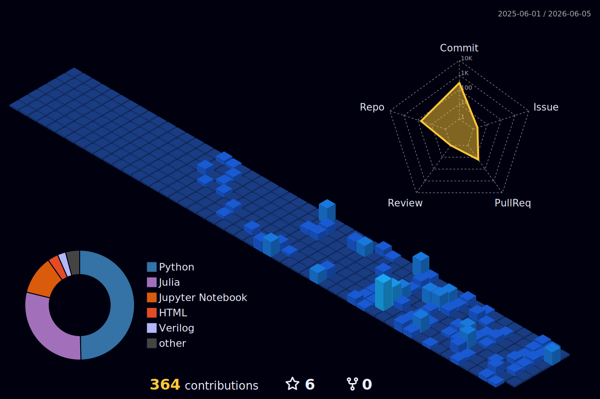

<h1 align="center">Hi 👋, I'm Rainer</h1>

  

 
   
   

---

### 👨‍💻 About Me

- 🔭 I’m currently working on **[Digital Twin modelling on AUV](https://github.com/rainerrodrigues/AUV-Digital-Twin)**
- 🌱 I’m currently learning **Julia, Rust, and SystemVerilog**
- 👯 I’m looking to collaborate on **[Exercism Julia, R, and Haskell tracks](https://exercism.org/tracks)**
- 🤝 I’m looking for help with **professional mentorship and open-source contributions**
- 📝 I regularly write articles on **[AppliedKaos](https://appliedkaos.blogspot.com/)**
- 💬 Ask me about **Languages, History, Geography, and Geopolitics**
- ⚡ Fun fact: **I know how to play the Ukulele!**

---

### 🛠️ Languages and Tools

   
  <b>Core Languages</b> 
   
  
    
  <b>Data & AI</b> 
   
  
    
  <b>DevOps & Tools</b> 
   
  

---

### 📊 GitHub Stats

  <table>
    <tr>
      <td valign="top"></td>
      <td valign="top"></td>
    </tr>
  </table>
  

<h3 align="center">My Contribution Graph</h3>

  

---

### ✍️ Latest Blog Posts
---

### 📫 Let's Connect

  
  
  
  
  

